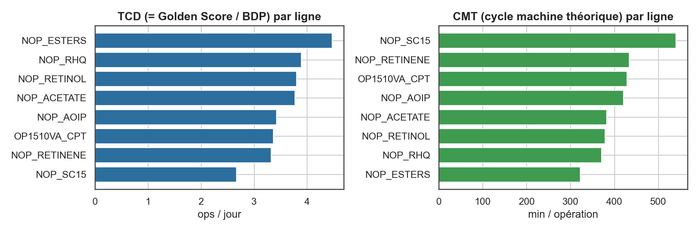

# Introduction

L'atelier Vitamines dispose, pour plusieurs lignes de production, d'un
compteur cumulatif du nombre d'opérations réalisées (`value_nop`),
échantillonné à la minute. Ce compteur reste constant pendant qu'une
opération est en cours puis s'incrémente au passage à l'opération suivante :
une opération correspond donc à un plateau de valeur constante du signal.

L'objectif de cette étude est d'identifier, pour chaque ligne, trois
indicateurs directement exploitables dans un calcul d'OEE (Overall Equipment
Effectiveness) : le **Cycle Machine Théorique (CMT)**, le **Taux de Cadence
Théorique (TCD)** et la **Best Demonstrated Performance (BDP)**, à partir
d'une méthode de scoring reproductible baptisée *Golden Score*.

# Méthodologie

## Nettoyage et reconstruction des opérations

Le signal brut est nettoyé (suppression des valeurs manquantes ou
négatives), puis les opérations sont reconstruites en identifiant les
plateaux de valeur constante du compteur. La durée d'une opération est le
temps écoulé jusqu'au début du plateau suivant. Les opérations dont la durée
sort d'un intervalle de cohérence (bruit capteur en deçà, arrêt de ligne
prolongé au-delà) sont écartées avant tout calcul de performance.

## Estimation de la fenêtre de référence (BDP à 7 jours)

Plutôt que de fixer arbitrairement un nombre d'opérations censé représenter
une semaine de production, la taille de fenêtre est estimée pour chaque
ligne : on recherche, par ajustement itératif, la taille de fenêtre dont la
meilleure séquence consécutive observée couvre une durée proche de sept
jours. Cette fenêtre devient la référence de performance de la ligne.

## Indicateurs dérivés

Sur cette fenêtre de référence, on calcule :

- le **CMT** (Cycle Machine Théorique) : durée moyenne d'une opération sur la
  meilleure séquence observée (minutes/opération) ;
- le **TCD** (Taux de Cadence Théorique) : capacité équivalente de la même
  séquence, exprimée en opérations par jour ;
- la **BDP** (Best Demonstrated Performance) : la performance la plus élevée
  réellement observée sur une fenêtre de cette taille, dont le TCD est
  directement dérivé.

# Résultats

## Vue d'ensemble par ligne

| Tag          |   N ops (nettoyées) |   Durée moy. (min) |   Durée méd. (min) |   Nb ops run golden |   TCD (ops/j) |   Temps standard (min/op) |
|:-------------|--------------------:|-------------------:|-------------------:|--------------------:|--------------:|--------------------------:|
| NOP_ESTERS   |                9336 |              470.5 |              421.5 |                  20 |          4.47 |                     322.4 |
| NOP_RHQ      |                9450 |              471   |              420   |                  19 |          3.89 |                     370.3 |
| NOP_RETINOL  |                9470 |              471.6 |              420   |                  19 |          3.8  |                     378.7 |
| NOP_ACETATE  |                9471 |              472.3 |              420   |                  26 |          3.77 |                     382.2 |
| NOP_AOIP     |                7227 |              549   |              510   |                  20 |          3.42 |                     420.9 |
| OP1510VA_CPT |                3575 |              523.5 |              480   |                  24 |          3.36 |                     428.5 |
| NOP_RETINENE |                8821 |              501.8 |              456   |                  23 |          3.32 |                     434   |
| NOP_SC15     |                7185 |              608.3 |              560   |                  19 |          2.67 |                     539.9 |

## Comparaison inter-lignes

# Discussion et limites

La référence retenue (BDP) est par construction un **record observé**,
donc structurellement optimiste : pour une référence OEE soutenable dans la
durée, un percentile (par exemple le 10e centile) des fenêtres glissantes de
même taille constitue une alternative à envisager plutôt que le record
absolu. Le filtre de durée est actuellement appliqué de façon uniforme à
toutes les lignes ; un profil de durée très différent d'une ligne à l'autre
justifierait une validation spécifique de ce seuil. Enfin, la fenêtre de
référence étant ré-estimée indépendamment pour chaque ligne, une comparaison
brute du nombre d'opérations entre lignes est moins pertinente qu'une
comparaison directe en opérations par jour (TCD).

# Conclusion

La méthode du Golden Score permet d'obtenir, pour chaque ligne de l'atelier
Vitamines, un triplet CMT/TCD/BDP directement exploitable comme référence de
performance théorique dans un calcul d'OEE, sans hypothèse arbitraire sur la
durée d'un cycle de référence. Les prochaines étapes consistent à croiser ces
indicateurs avec les volumes réellement produits (calcul complet de l'OEE) et
à suivre dans le temps la stabilité de la fenêtre de référence par ligne,
elle-même un signal utile de dérive de procédé.

